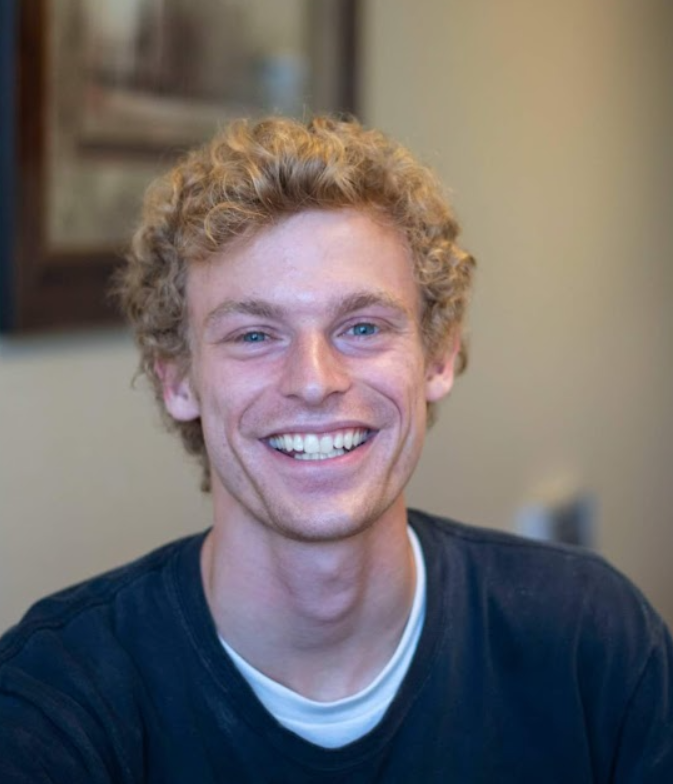

I'm an applied statistics student from BYU with an interest in making the world better through data. My interests include social psychology, product response, and marketing analysis. I hope to one day be a data analyst for Hinge, helping people find their happily ever after. Some of my projects include the dry ice–water reaction and happiness indicators for college students in Provo. 

## Education

- **Statistics** - Brigham Young University, expected graduation spring of 2027.

- **Relevant Coursework**: 
STAT 340 – Statistical Analysis
CS 110 – Basic Python Coding
STAT 250 – Basic R Programming

## Skills & Interests

### Technical Skills
- **Programming**: Python, R, SQL
- **Data Analysis**: Pandas, NumPy, R, SQL
- **Visualization**: Matplotlib, Seaborn
- **Machine Learning**: Scikit-learn
- **Tools**: Jupyter Notebooks, Git/GitHub

### Areas of Interest
- Psychology,  storytelling with data,
- Science

## Goals

Describe what you hope to achieve through your data science journey:

- Short-term learning objectives: improve coding skills and gain releven experiance in data annalitics
- Long-term career aspirations: find better ways for people to live happy lives and prosper
- Types of problems you want to solve: market identification, who is interested in _______? what tells me thery are intorested?

## Contact

- **Email**: scott.merling1@gmail.com
- **GitHub**: [github.com/your-username](https://github.com/your-username)
- **LinkedIn**: [linkedin.com/in/your-profile](https://linkedin.com/in/your-profile)

---

*This portfolio showcases my learning progress and projects completed during my data science studies.*
